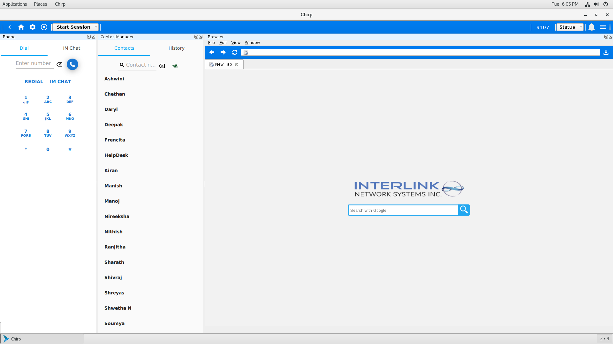
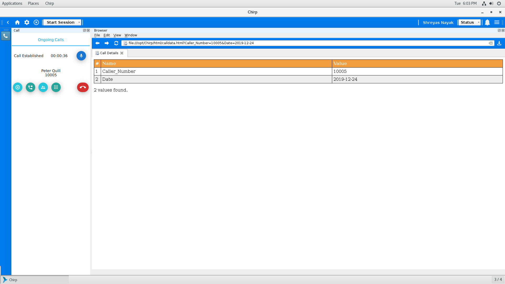
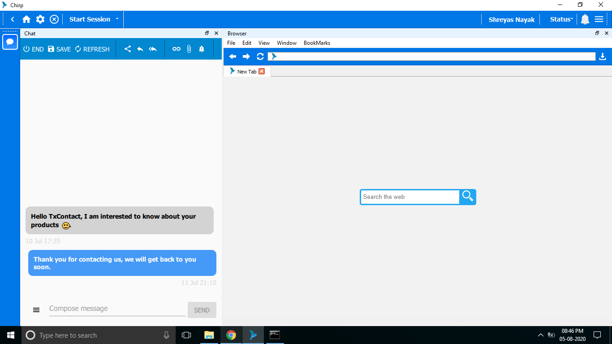

   

Designed and developed a cross-platform desktop application for contact center agents, leveraging the [Qt framework](https://github.com/qt) and [PJSIP](https://github.com/pjsip/pjproject) stack. The application enables agents to manage VoIP calls, live chats, and social media interactions within a unified interface.

Key features include:
- Embedded browser for seamless CRM popups  
- PJSIP/SIP stack integration for handling VoIP calls  
- CRM integrations with Zoho, Salesforce, and other platforms  
- WebSocket and HTTP APIs to support Computer Telephony Integration (CTI)  
- DevOps CI/CD pipelines for building and deploying *Chirp* across multiple operating systems  

Main Page :

Call Session :

Chat Session : 

